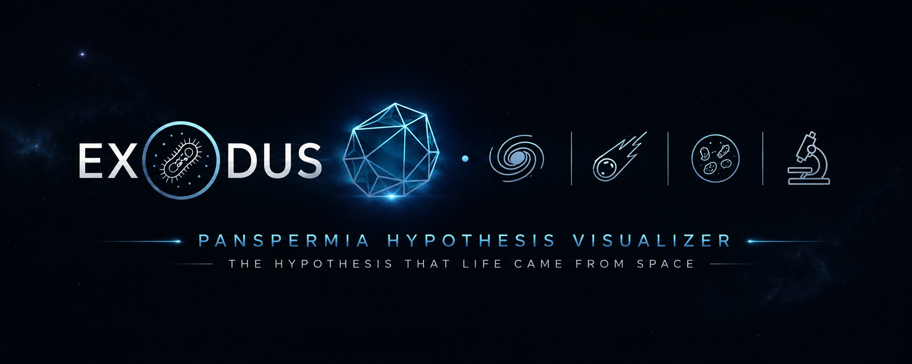

 
   

 

# 🦠 EXODUS

### *Interactive Panspermia & Astrobiology Visualizer*

> Exploring the **Panspermia Hypothesis** through microbial cell anatomy and proposed mechanisms of microbial transfer through space.

  🌐 <a href="YOUR-CLOUDFLARE-URL"><strong>Live Demo</strong></a>

**🦠 Microbiology · 🪐 Astrobiology · 🚀 Panspermia**

---

## ✦ Features

**🧬 Interactive Cell Anatomy**  
Explore prokaryotic structures through interactive scientific annotations.

**🚀 Panspermia Simulation**  
Visualize proposed mechanisms of microbial transfer through space.

**🔬 Scientific Visualization**  
Built as an educational tool with a focus on biological accuracy.

**📱 Responsive Design**  
Designed for both desktop and mobile browsers.

---

## ⚙️ Technology

**HTML · CSS · JavaScript · Three.js**

**Source:** GitHub · **Hosting:** Cloudflare Pages

---

## 📜 License

**GNU General Public License v3.0 (GPL-3.0)**
